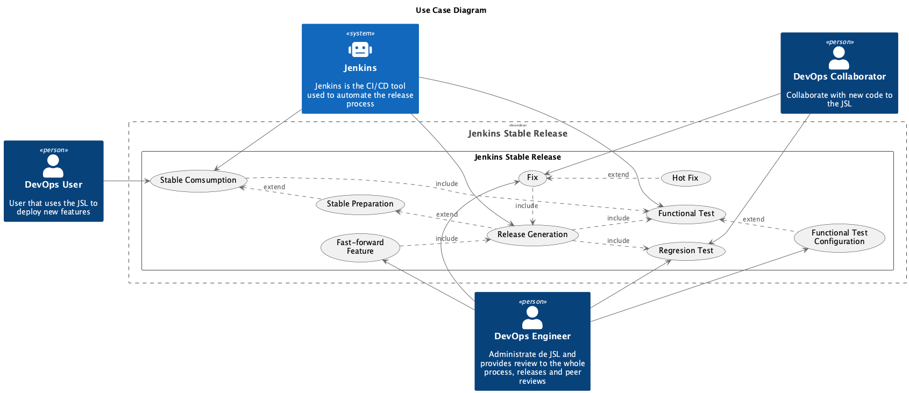

# 1 Introduction and Goals

<!-- TOC -->

- [1 Introduction and Goals](#01-introduction-and-goals)
    - [1.1 Requirements Overview](#11-requirements-overview)
    - [1.2 Quality Goals](#12-quality-goals)
    - [1.3 Systems Stakeholders](#13-systems-stakeholders)

<!-- /TOC -->

The overall goal is to be able to have a stable and functionally tested release for the JSL that can be seamlessly used by the different teams to operate their pipelines, with the capability to receive fixes in the shorter term as possible and features in a maximum period of one month. Once done, the libraries should be prepared to integrate with the Automatic Change Management process to be able to be used by the mature applications.

One of the main decisions made to continue with this project was the creation of Stable release concept.

The stable release is considered a release that has lived for some time in the system, used by early adopter and that and is considered as tested enough to be released to the rest of the teams.

## 1.1 Requirements Overview

| ID | Use Case (Functional Requirement) | Description |
|----|-----------------------------------|-------------|
| UC-001 | Release Generation | - Jenkins should be able to automatically generate a release without the intervention of any engineer.  - The release is considered as an standard one (Timed YYYY.MM.DD) and should include Minor and Patch Version (YYYY.MM.DD.Minor.Patch). - Release should be possible to be still manually generated on request. - Releases on same day should automatically increase Minor. - Release Should include Release Notes of what has been done from one release to another in a proper documented way. - Any issue on a release generation should be notified |
| UC-002 | Regression Tests | System should automatically detect regressions when possible and Engineers and collaborators should be able to generate and verify the regression traces |
| UC-003 | Functional Tests | - System should automatically trigger functional Tests that need to be passed in order to continue with any release generation.  - Functional Tests need to run out of JSL pipeline but results should be stored in Jira.  - JSL pipeline should wait for external execution and retrieve Jira test when finished.  - JSL pipeline need to verify the execution result. |
| UC-004 | Functional Test Configuration | DevOps Engineer should be able to configure, add, delete or modify functional tests that are executed as part of the JSL vía GitHub |
| UC-005 | Stable Preparation | - System should be able to prepare the next stable release which should include features from prior to the PRE-release generation and fixes and hot fixes from that point of time until the stable release generation. - Prerelease should include release notes of what is included. - Prerelease should be never consider as a final release and will be always considered a prerelease version (not published). |
| UC-006 | Stable Generation | - Twice a month (each 15 days) a stable release should be automatically generated based on prerelease.  - A stable generation execution does not need to build, test or pass any mandatory execution.  - A stable release will only verify that functional Tests have been passed prior generation. |
| UC-007 | Fix | - A DevOps Engineer or Collaborator should be able to generate a fix whenever is required. - A Fix should pass all the regression tests. - A Fix should pass all the functional tests prior release generation - A fix should be automatically included in current release - A fix should be automatically included in the pre-release if possible - Release notes with the Fix should be included as part of the release |
| UC-008 | Hot Fix | - A DevOps engineer or Collaborator  should be able to tag a Fix as a HotFix   - A HotFix is a special type of fix where the fix need to be passed to stable.  - A HotFix will generate a branch which will produce a pull request to stable with a label as a hot-fix  - Branch will include a CHANGE-LOG that will generate the release notes.  - Once merged to Stable, it should automatically generate new release.  - Any failure on the process need to be notified |
| UC-009 | Fast-Forward Feature | - As a DevOps Engineer I should be able to manually generate a branch that will be later used to produce a pull request to stable. - A fast Forward feature is an important feature that need to enter in stable due an exceptional event, for that reason this procedure should not be automatic. |

## 1.2 Quality Goals

Based on [ISO 25010](https://www.iso.org/es/contents/data/standard/07/81/78176.html) we have defined the following quality goals for the project:

| Priority | Quality | Motivation |
|---|---|---|
| 1 | Compatibility | The   System should be compatible with current release system, therefore, might   support standard releases by request apart of the manual ones. |
| 1 | Suitability | Functional   Testing should emulate the target environment (Jenkins) and therefore should   be executed in the environment |
| 1 | Operability | - Any release operation, success or fail   should notify JSL administrators about it.  - Also, errors should be self explanatory enough to be able to evaluate the   problem. |
| 2 | Usability | Regression Testing should be easily enough explained to be generated by a Collaborator |
| 2 | Maintainability | All the code should be available for JSL Administrators in GitHub |
| 3 | Transferability | System should be able to run in any of the Jenkins instances |
| 3 | Performance | System should be able to complete the compile, test and release generation in less   than an hour. |

## 1.3 Systems Stakeholders

| Role | Description | Goal/Intention |
|---|---|---|
| DevOps Administrator | Administrate de JSL and provides review to the whole process, releases and peer reviews | - Wants   to be able to generate releases on request.   - Want to be able to administrate Fixes, Hot Fixes and Fast-Forward elements.   - Needs to review release generation issues.   - Administrate Functional Tests. |
| DevOps Collaborator | Collaborate with new code to the JSL | - Wants   to add new features or fixes to the JSL.   - Needs to generate or regenerate regression traces.   - Need to be informed on the issues in their pull request. |
| DevOps Users | Use the   JSL as part of their pipelines | Want an   stable and functional library version that does not require changes in self pipelines in time.|
| GitHub App | Application that will be used aas an automated layer to authenticate M2M to the system and GitHub | - Wants   to be able to authenticate to GitHub and Jenkins.   - Needs to be able to generate branches and pull requests.   - Needs to be able to generate releases. |