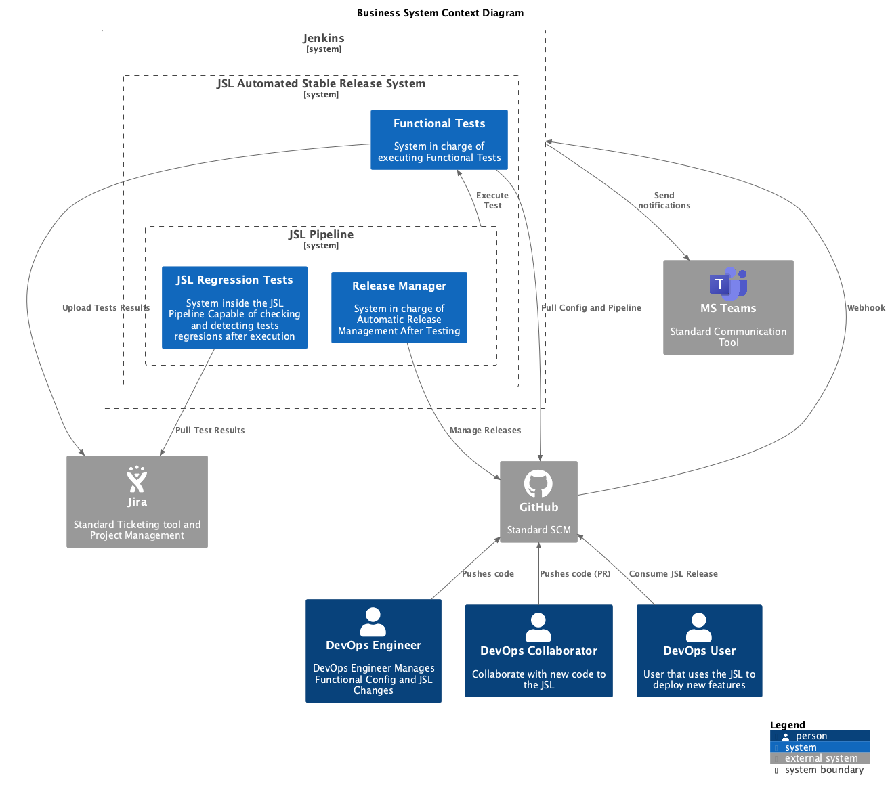
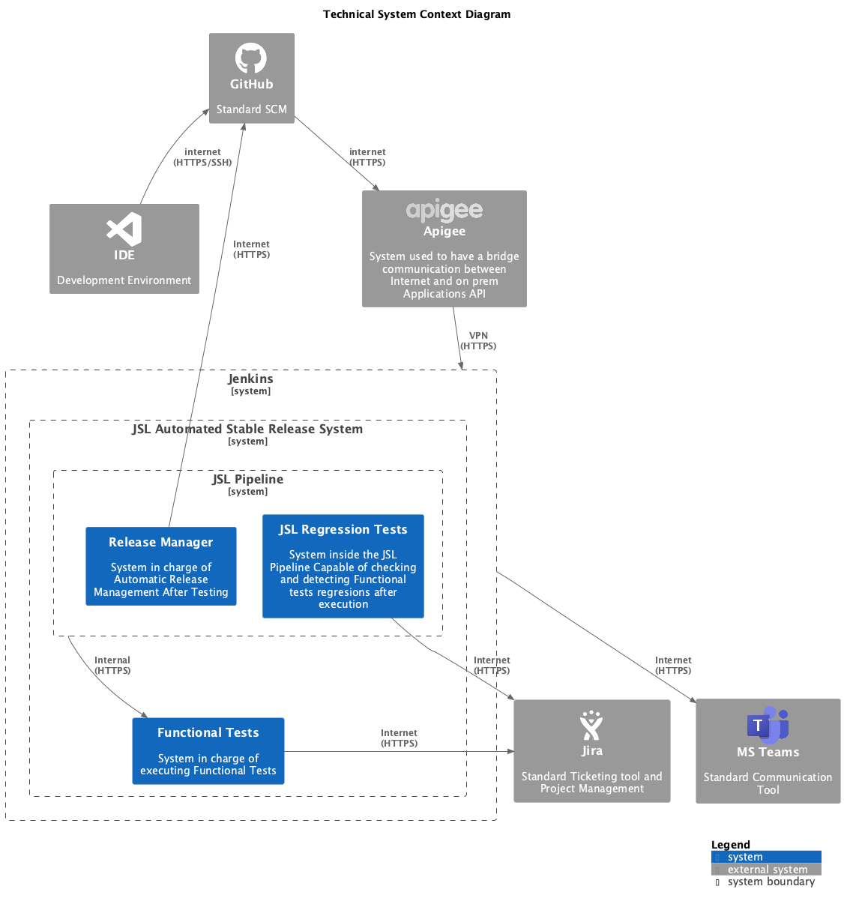

# 3 System Context and Scope

<!-- TOC -->

- [System Context and Scope](#system-context-and-scope)
    - [System Context Diagram](#system-context-diagram)
- [Solution Content](#solution-content)

<!-- /TOC -->

This architecture follow the patterns of [C4 Model](https://c4model.com/) and the [4+1 Architectural View Model](https://en.wikipedia.org/wiki/4%2B1_architectural_view_model)

This section contain all the delimits of the systems and communications

## 3.1 System Context Diagram

| Neighbour | Description |
|:---:|:---:|
| DevOps Engineer | In charge of administrate the solution |
| GitHub | Source Code Management Tool used to store the code of the functional tests and the JSL. Tool to administrate the releases generated in the JSL |
| Jira | Agile Development tool used to store the Tests using XRAY to be later consume by the JSL Pipeline |
| MS Teams | Main Communication tool where the notifications about the status of the pipelines, releases generation and publish release notes |
| Jenkins | Build system which will execute the different componentes and pipelines |
| Apigee | API Gateway used to communicate Internet Apps to Jenkins |

<!-- CONTENTTABLE:START -->
# Solution Content

1. [Introduction and Goals](01-introduction-and-goals.md)
2. [Technical Constraints](02-technical-constraints.md)
3. [System Context and Scope](03-system-context-and-scope.md)
4. [Building Block View](04-building-block-view.md)
5. [Runtime Overview](05-RuntimeOverview.md)
6. [Design Decisions](06-design-decisions.md)
7. [Technical Risks](07-technical-risks.md)
8. [Results](08-Results.md)
<!-- CONTENTTABLE:END -->
