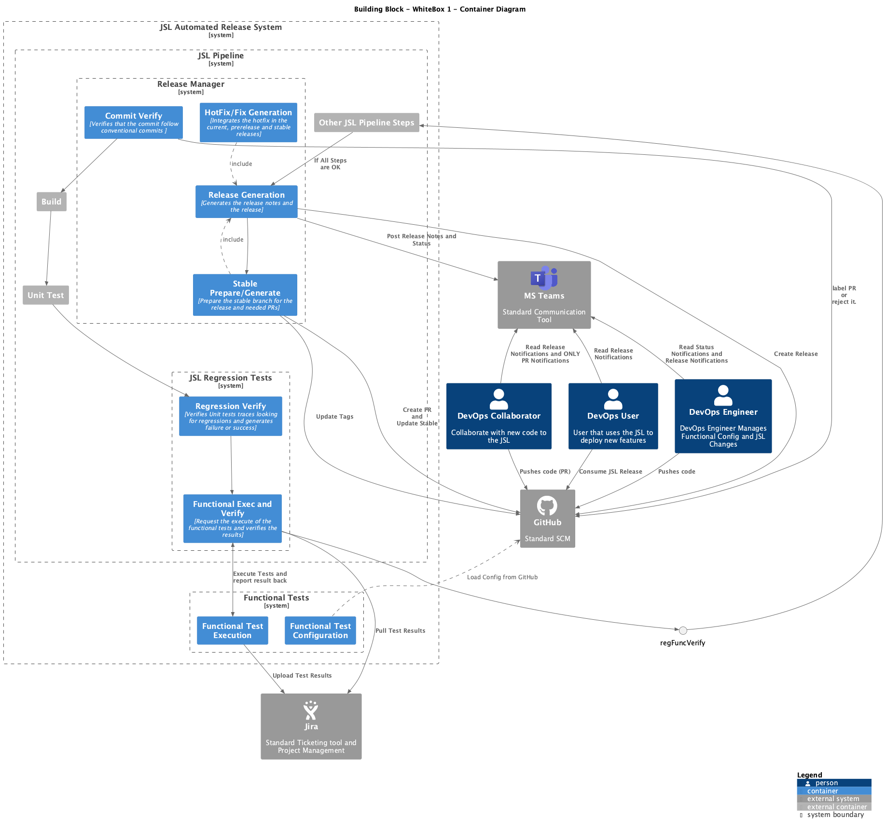
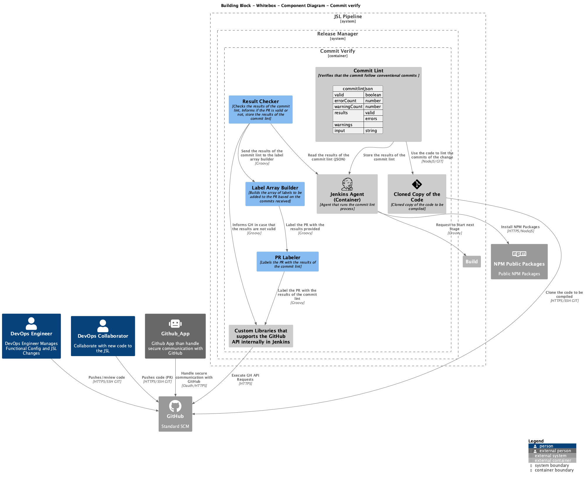
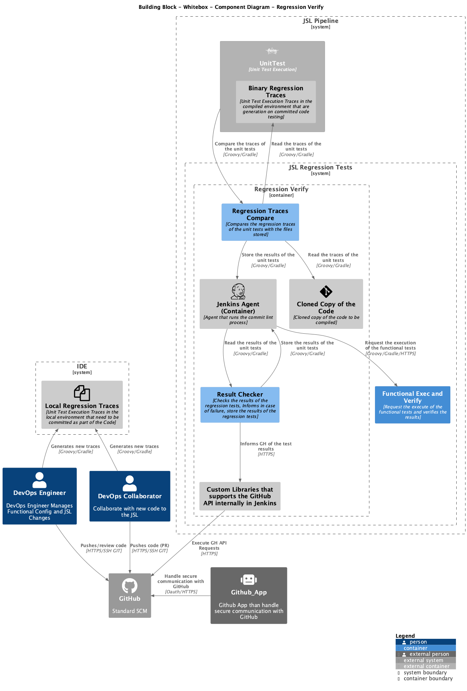
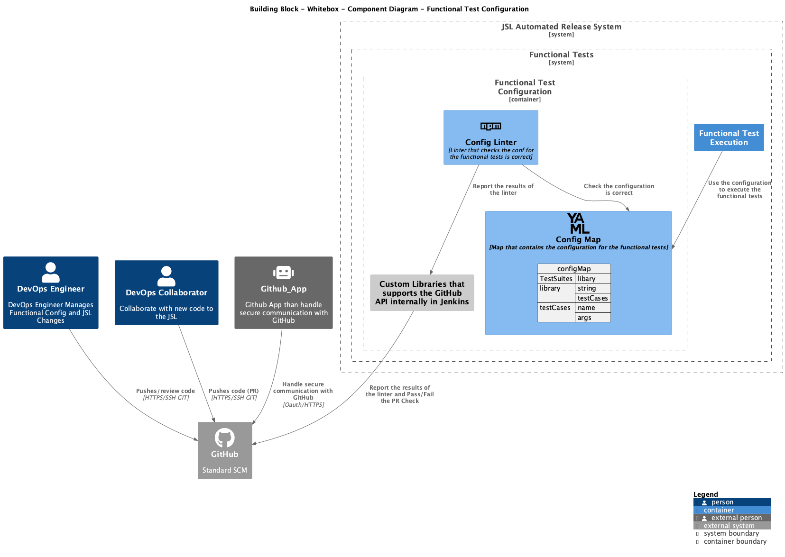

# 4 System Context and Scope

<!-- TOC -->

- [4 System Context and Scope](#4-system-context-and-scope)
    - [4.1 Withebox - Container Diagram](#41-withebox---container-diagram)
    - [4.2 Blackbox - Components Diagram](#42-blackbox---components-diagram)
            - [4.2.1.1 Code Implementation Example](#4211-code-implementation-example)
        - [4.2.2 Regression Verify](#422-regression-verify)
            - [4.2.2.1 Code Implementation Example](#4221-code-implementation-example)
        - [4.2.3 Functional Execution and Verify](#423-functional-execution-and-verify)
            - [4.3.2.1 Code Implementation Example](#4321-code-implementation-example)
        - [4.2.4 Functional Execution](#424-functional-execution)
            - [4.2.4.1 Code Implementation Example](#4241-code-implementation-example)
        - [4.2.5 Functional Test Configuration](#425-functional-test-configuration)
        - [4.2.6 Release Generation](#426-release-generation)
            - [4.2.6.1 Code Implementation Example](#4261-code-implementation-example)
        - [4.2.7 Stable Preparation/Generation](#427-stable-preparationgeneration)
            - [4.2.7.1 Code Implementation Example](#4271-code-implementation-example)
        - [4.2.8 Hotfix Generation](#428-hotfix-generation)
            - [4.2.8.1 Code Implementation Example](#4281-code-implementation-example)

<!-- /TOC -->

Based on the context diagrams we can detail the different components of the solution

## 4.1 Withebox - Container Diagram

Understanding the Containers a separately runnable/deployable unit (e.g. a separate process space) that executes code or stores data, we can define the following containers:



| Component | Description |
|:---:|:---:|
| Commit Verify | This component will take the commit on any PR and verify that it is compliant with the conventional commits, except merge or reverts. Once extracted the type, it will label the PRs.  |
| Regression Verify | This component will be included as part of the current build system and will check the stacktraces and compare with the build in order to verify the existance of Regressions |
| Functional Execution and Verify | Simple component designed to request the execution of functional testing and  |
| Release Generation  | This system will be in share of the release generation keeping on demand and automated generation.  The version will be YYYY.MM.DD.MINOR.PATCH |
| Stable Preparation/Generation | Stable Preparation is the component in charge of prepare the prerelease to be used as the next stable generation as well as generate the stable release branch for later generation create (both methods will use the release generation) |
| Functional Execution | Pipeline in charge to load libraries on request and execute the configured tests |
| Functional Test Configuration  | Component in charge to load a yaml configuration for execution of tests |
| HotFix/Fix Generation | This component handle the pull requests that are labeled as fix or hot-fix. This include the manipulation of the releases and therefore include the release generation and stable preparation |

## 4.2 Blackbox - Components Diagram

<!-- ### 4.2.1 Commit Verify -->

This component takes the commits and verify that they comply with the conventional commit using [commitLint](https://github.com/conventional-changelog/commitlint/tree/master)  this is installed through npm, the results are checked by the resultChecker and finally the prLabeler will label the pr accordingly to be compliance with the release notes generation by GitHub with the help of the labelArrayBuilder.



| Component | Description | Inputs | Outputs |
|:---:|:---:|:---:|:---:|
| gitHubLibs | Custom Libraries that supports the GitHub API internally in Jenkins| GitHub API Requirements | Commits<br>PR |
| CommitLint | Verify that the commit is compliant with conventional commit | Git Commits | JSON with results |
| resultChecker | This Component Verifies that the commits lint results are correct and reject or accept the PR depending on the results | commitLintJSON | GitHub Message with negative result and description of errors per commits. Also generate an Error Call to Jenkins |
| labelArrayBuilder | This component receive the conventional commits and generate an array for later manipulaion with the prLabeler | Commits Conventional Regex | Labels Array |
| prLabeler | This component labels the pull request based on the type from the commits  | Labels Array | Label PR Update on GitHub |
| Jenkins | Jenkins is the orchestrator of the components | - | - |
| Code  | Cloned copy of the code to be compiled | - | - |

#### 4.2.1.1 Code Implementation Example

In this code snipped it can be seen a bit the way the components where integrated 

```groovy
steps {
    script {
      def npmHome = './node_modules/'
      def commitLint
      def prTitleLint
      sh (script: "npm install --save-dev @commitlint/cli @commitlint/config-conventional commitlint-format-json")
        sh (script: """
              set -ev
              ${npmHome}.bin/commitlint  --from=origin/${CHANGE_TARGET} --to=${env.GIT_COMMIT} --verbose -o commitlint-format-json > Commitlint.commits.json || true
          """, label: "Linting Things" )
      def catLint = sh (script: "cat Commitlint.commits.json", returnStdout: true).trim()
      commitLint = readJSON text: $/${catLint}/$
      if (!commitLint.valid) {
        archiveArtifacts artifacts: "Commitlint.commits.json", fingerprint: true
        def message = ":bangbang: :bangbang: Errors found in commits<br />Please follow [CONVENTIONAL COMMITS](https://github.com/Org/lib-shared#conventional-commits):<br />"
        for (result in commitLint.results) {
          if (!result.valid) {
            message = message + "<br />" + result.input + "<br />"
            for (errorResult in result.errors) {
              message = message + "<li>" + errorResult.message+ "</li>" + "<br />"
            }
          }
        }
        try {
          libGitHubMessage(message.replaceAll('[\n\r]+','<br />'))
        } catch (e) {
          echo(message)
          message = ":bangbang: :bangbang: Errors found in commits<br />We haven't been able to identify the problems, probably you have included characters that are not acccepted for Github Messages<br />Please follow [CONVENTIONAL COMMITS](https://github.com/Org/lib-shared#conventional-commits) and verify your commits"
          libGitHubMessage(message.replaceAll('[\n\r]+','<br />') )
          error 'Error' + e.getMessage() + 'found in commits: Please follow <a href="https://github.com/Org/lib-shared#conventional-commits>CONVENTIONAL COMMITS</a>"'
        }
        error 'Errors found in commits: Please follow <a href="https://github.com/Org/lib-shared#conventional-commits>CONVENTIONAL COMMITS</a>"'
      } else {
        def message = ":white_check_mark: :white_check_mark: Commit is compliant with Conventional Commits :white_check_mark: :white_check_mark:"
        libGitHubMessage(message)
      }
      def convetionalRegex = /^(?<type>build|chore|ci|docs|feat|fix|perf|refactor|Revert|style|test)(?<scope>\(\w+\)?((?=:\s)|(?=!:\s)))?(?<breaking>!)?(?<subject>:\s.*)/
      def conventionalCommits = commitLint.results.findAll { it.input =~ convetionalRegex  }
      def labelsArray = labelArrayBuilder(conventionalCommits, convetionalRegex)
      prLabeler(labelsArray)      
    }
  }
```

In summmary and taking a bot of advange of AI generated summaries

1. **Setup and Install Dependencies**:
   - The script installs necessary npm packages for commit linting using `npm install --save-dev @commitlint/cli @commitlint/config-conventional commitlint-format-json`.

2. **Linting Commits**:
   - It runs the `commitlint` tool to check commit messages from the target branch to the current commit and outputs the results in JSON format to `Commitlint.commits.json`.

3. **Read and Parse Lint Results**:
   - The script reads the JSON file and parses the results using `readJSON`.

4. **Handle Linting Errors**:
   - If any commit messages are invalid, it archives the JSON file and constructs an error message detailing the issues found.
   - It attempts to send this message to GitHub using `libGitHubMessage`. If this fails, it logs the message and raises an error.

5. **Success Message**:
   - If all commit messages are valid, it sends a success message to GitHub.

6. **Labeling Commits**:
   - The script uses a regex pattern to identify conventional commits and extracts their types.
    - It generates an array of labels based on the commit types using `labelArrayBuilder`.
    - It labels the pull request with the generated labels using `prLabeler`.

```groovy
def prLabeler(def labels) {

  def labelArray = []

  labels.each { type ->

    def label
    if (type == 'fix') {
      label = 'bug'
    } else if (type == 'feat') {
      label = 'enhancement'
    } else if (type == 'docs') {
      label = 'documentation'
    } else if (type == 'style') {
      label = 'style'
    } else if (type == 'refactor') {
      label = 'refactor'
    } else if (type == 'perf') {
      label = 'performance'
    } else if (type == 'test') {
      label = 'test'
    } else if (type == 'ci') {
      label = 'ci'
    } else if (type == 'refactor') {
      label = 'refactor'
    } else if (type == 'revert') {
      label = 'revert'
    } else if (type == 'build') {
      label = 'build'
    } else {
      label = 'chore'
    }

    labelArray.add(label)

  }

  def response = libGitHubLabels('issue','POST',labelArray)

}
```

This get help from the labelArrayBuilder that is a simple function that will generate an array of labels based on the type of the commit

```groovy
@NonCPS
def labelArrayBuilder(def conventionalCommits, def convetionalRegex) {

  def labels = []
  conventionalCommits.each { commit ->
    def match = ( commit.input =~ convetionalRegex )
    def type = match[0][1]
    labels.add(type)
  }

  return labels
}
```


### 4.2.2 Regression Verify


The regression Tests need to be integrated in the unit test without need from developer to update or require any information except when the update of traces is required. the traces are stored as part of the Code, if the traces generated differ with the ones stored in the Code, the system will generate an error and send a message to GH about the errors.

This integration is possible with the help of the [JenkinsPipelineUnit](https://github.com/jenkinsci/JenkinsPipelineUnit?tab=readme-ov-file#compare-the-callstack-with-a-previous-implementation) which already have a way to use this kind of tests.



| Component | Description | Inputs | Outputs |
|:---:|:---:|:---:|:---:|
| Regression Trace Compare | Regression Test is an internal part of the Unit testing framework which compares traces stored with the generated ones in the Test Execution.  In case of difference, the whole compilation will fail. | Stacktraces (On FS and memory) | OK or NOK |
| Results Checker | This component will check the results of the regression test and will send a message to GitHub in case of failure as well as storing the html results | Gradle & Junit results | GitHub Message<br>HTML Page | 

#### 4.2.2.1 Code Implementation Example

This component had a part of code that was made in the stage of Jenkins (Results Checker) and another that was part of the tests of itself

An example of a trace is like this

```text
  libGitHubDeploymentCreate.call(ARGS)
     libGitHubDeploymentCreate.libGitGetRepoOwner()
     libGitHubDeploymentCreate.libGitGetRepoName()
     libGitHubDeploymentCreate.libGetDebugCallback(github)
     libGitHubDeploymentCreate.libGitHubRequestsHandler(https://api.github.com/repos/null/null/deployments, Create GitHub deployment for ARGS, [Accept: application/vnd.github+json], POST, {ref=ARGS, auto_merge=false, environment=staging, required_contexts=[], deploymentTask=deploy}, GITHUB_TOKEN_CREDENTIALS)
     libGitHubDeploymentCreate.libPrintAnsi(ERROR: Unknown GitHub error and could not create deployment: [meta:[Cache-Control:private, max-age:60, s-maxage:60, Vary:Accept, Authorization, Cookie, X-GitHub-OTP, ETag:bc04f3d6b57b6ebce5397036dc264008fa099935d3074b1c47896d1558ceea00, Contents-Type:application/javascript; charset:utf-8, X-RateLimit-Limit:5000, X-RateLimit-Remaining:4994, X-RateLimit-Reset:1664455756, X-RateLimit-Used:6, X-RateLimit-Resource:core, X-OAuth-Scopes:admin:enterprise, admin:gpg_key, admin:org, admin:org_hook, admin:public_key, admin:repo_hook, delete:packages, delete_repo, gist, notifications, repo, user, workflow, write:discussion,write:packages, X-Accepted-OAuth-Scopes:, X-GitHub-Media-Type:github.v3; format:json, status:200], data:[]]; payload: [ref:ARGS, auto_merge:false, environment:staging, required_contexts:[], deploymentTask:deploy], 3)
```

This is generated once the framework is called internally to run the tests 

```groovy
package io.lib.jenkins

import org.junit.Assert
import org.junit.Before
import org.junit.Test


class GitHubDeploymentCreateTest extends GenericSuccessTest {

    GitHubDeploymentCreateTest() {
        super.scriptName = 'vars/libGitHubDeploymentCreate.groovy'
    }

    @Before
    @Override
    void setUp() throws Exception {
        super.setUp()
		callStackPath = 'test/resources/callstacks/'
        [...]

    }

    @Override
    void callScript() {
        [...]
    }

    @Test
    void testTriggerArgs() {
        [...]
        testNonRegression('testTriggerArgs')
    }

}

```

Once this is done and it is compared with the stored traces, the results are checked by the Results Checker that will actually extract the Junit result a process it in a way the developer can understand what is happening.

```groovy
def result = libBuildGradle('clean test --parallel -q', true)
libPublishTestResults("build/reports/**/*.xml")
if (!result) {
  libPublishHTMLTestResults('index.html','build/unithtml/', 'JSL TEST HTML Report')
  def message = ":bangbang: :bangbang: Errors found in Build Stage, probably because of a Failed Test or you may forgot Regression Tests<br />Guidelines:<br />* [How To Create Unit Tests](https://github.com/Org/lib-shared/wiki/HOWTO-Create-Unit-Test-for-JSL)<br />* [Regression Tests](https://github.com/Org/lib-shared#regression-tests)<br />* [JUnit Tests Result](${env.BUILD_URL}/JSL_20TEST_20HTML_20Report)"
  libGitHubMessage(message)
  error """Build failed, please check <a href="${env.BUILD_URL}/JSL_20TEST_20HTML_20Report"> Test results </a>or logs at build stage"""
}
libPublishHTMLTestResults('index.html','build/jacocoHtml/', 'JSL COVERAGE HTML Report')
```

### 4.2.3 Functional Execution and Verify

The functional tests are executed in a separated pipeline that is triggered by the JSL pipeline. The results are stored in Jira and the JSL pipeline will wait for the results to continue with the release generation.

This particular component help to trigger and wait for the results of the functional tests.


| Component | Description | Inputs | Outputs |
|:---:|:---:|:---:|:---:|
| Remote Test Executer | This component will trigger the execution of the functional tests (with the help of alreasy existing jenkins method) with certain parameters related of this execution | Test Execution Request | OK/NOK |
| Jenkins | Jenkins is the orchestrator of the components | - | - |
| Jira Puller (libJiraPullTestResults) | This component will pull the results of the functional tests from Jira and will store them in a file for later use | Jira Test ID | File with Results |
| libCheckQAGates | External component to compare the results between 2 different jira test results | Jira Test Results | OK/NOK |

#### 4.3.2.1 Code Implementation Example

In general this was not a complex element to implement, the main part was the trigger of the functional tests and the wait for the results

```groovy
    script {
      def buildCauses = currentBuild.getBuildCauses()
      def startedFromTimer = buildCauses.any { cause -> cause._class == 'hudson.triggers.TimerTrigger$TimerTriggerCause' }
      if (!startedFromTimer) {
        if (!params.STABLE_RELEASE) {
          libTriggerRemoteJob('main','JSL/lib-functional-validation/', false, true, 1,  [text(name: 'prNbr', value: ''), text(name: 'BRANCH_TO_TEST', value: env.PROD_BRANCH)])
        }
      }
      libJiraPullTestResults('TICKETTEST-1234')
      libCheckQAGates("testRunStatus.json")
    }
```

For the libJiraPullTestResults the flow was as simple as taking a fix testresult feature in Jira and the XRAY licence, we were able to extract the information in a json directly in the pipeline. However this still required several steps:

1. **Get Token** : The first step was to get the token from Xray to be able to access the information, implementing retry mechanish in case of failure.
2. **Get Test Execution ID** : Once the token was obtained, the next step was to get the Test Execution ID from Jira.
3. **Get Test Results** : With the Test Execution ID, the final step was to get the Test Results from Jira and store them in a file for later use after some test processing

```groovy
import groovy.json.JsonOutput 

def call(def issueKey, def jiraCredentials = env.JIRA_TESTAUTO_CREDENTIALS, def xrayCredentialId = env.XRAY_TESTAUTO_ID_SECRET) {
    token = getAuthorizationToken(xrayCredentialId)
    objectId = getObjectId(issueKey, jiraCredentials)
    if (objectId != null && token != null) {
        return getTests(token, objectId)
    }
    return null
}

def getAuthorizationToken(def xrayCredentialId) {
    def tokenResponse = ''
    def maxWaitForSeconds = 5
    def retries = 5
    while (retries > 0) {
        def sleepTime = maxWaitForSeconds * (1/retries)
        withCredentials([file(credentialsId: xrayCredentialId, variable: 'XRAY_CREDENTIALS_FILE')]) {
	        def jira_file = sh script: """
            set + x
            cat \$XRAY_CREDENTIALS_FILE
            """,label: 'getting XRAY credentials',returnStdout: true
            
            def CLIENT_ID = (jira_file.tokenize('\n')[0]).tokenize('=')[1]
	        def CLIENT_SECRET = (jira_file.tokenize('\n')[1]).tokenize('=')[1]

            tokenResponse = sh script: """[..]
            """,label: 'getting authentication token', returnStdout: true
        }
        if (tokenResponse.split("\n")[1] == '200') {
            token = tokenResponse.split("\n")[0].replaceAll("\"", "")
            return token
        }
        sleep(time:sleepTime, unit:"SECONDS")
        retries -= 1
    }
    echo "Request failed. Error message: ${tokenResponse.split("\n")[0]}"
    return null
}

def getObjectId(String issueKey, def jiraCredentials) {
    def objectIdResponse = ''
    def maxWaitForSeconds = 5
    def retries = 5
    while (retries > 0) {
        def sleepTime = maxWaitForSeconds * (1/retries)
        withCredentials([usernamePassword(credentialsId: jiraCredentials, passwordVariable: 'jira_token', usernameVariable: 'jira_username')]) {
            objectIdResponse = sh(script: """[...]""",
                label: 'getting test plan object id', returnStdout: true).trim()
        }
        if (objectIdResponse.split("\n")[1] == '200') {
            def object = readJSON text: objectIdResponse.split("\n")[0]
            return object.id
        }
        sleep(time:sleepTime, unit:"SECONDS")
        retries -= 1
    }
    echo "Request failed. Error message: ${objectIdResponse.split("\n")[0]}"
    return null
}

def getTotalTestsCount(String token, Object objectId)
{
    def maxWaitForSeconds = 5
    def retries = 5
    while (retries > 0) {
        def sleepTime = maxWaitForSeconds * (1/retries)
        testCountResponse = sh(script: """[...]""",
            label: 'getting test count', returnStdout: true)

        if (testCountResponse.split("\n")[1] == '200') {
            def object = readJSON text: testCountResponse.split("\n")[0]
            return object.data.getTestPlan.tests.total
        }
        sleep(time:sleepTime, unit:"SECONDS")
        retries -= 1
    }
    echo "Request failed. Error message: ${testCountResponse.split("\n")[0]}"
    return null
}

def getTests(String token, Object objectId) {

    def output = '{"tests":[' 
    def maxWaitForSeconds = 5
    def retries = 5
    while (retries > 0) {
        def sleepTime = maxWaitForSeconds * (1/retries)
        def totalTests = getTotalTestsCount(token, objectId) 
        def limit = 100
        def totalTestsCeil = (totalTests + limit - 1).intdiv(limit)
	    boolean flag = false
        for (def test = 0; test < totalTestsCeil; test++) {
            def testResultsResponse = ''
            def startAt = test * limit
            testResultsResponse = sh(script: """[...]""",
                label: 'getting tests result', returnStdout: true)

            if (testResultsResponse.split("\n")[1] == '200') {
                flag = true
                def object2 = readJSON text: testResultsResponse.split("\n")[0]
                def testObjectCount = 1
                len = object2.data.getTestPlan.tests.results.size()
                for (def value: object2.data.getTestPlan.tests.results) {
			        def new_test = JsonOutput.toJson([testKey: "${value.jira.key}", status: "${value.status.name}"])
                    output = output + new_test
                    if (testObjectCount != len || test != totalTestsCeil - 1) {
                        output = output + ','
                    }
                    testObjectCount++
                }
            }
            else{
                echo "Request failed. Error message: ${testResultsResponse.split("\n")[0]}"
                echo "Retrying..."
            }
        }
        if (flag == true) {
            break
        }
        sleep(time:sleepTime, unit:"SECONDS")
        retries -= 1
    }
    output = output + ']}'
    writeFile(file: 'testRunStatus.json', text: output)
    return output
}
```

### 4.2.4 Functional Execution

Functional Test Execution runs out of the JSL Pipeline but inside Jenkins, it loads the libraries on request, JSL only will trigger the master execution, therefore other tests might be called manually. Once the libraries are loaded, it reads the config and proceed to run the tests either on docker or agent. Once finished the tests are verified and the uploaded to Jira to finally cleanup the environments.


| Component | Description | Inputs | Outputs |
|:---:|:---:|:---:|:---:|
| Map Load | This component load the configuration generated in the repo in order to preprare the tests to be executed | Config from GitHub | Prepared Tests to execute |
| Library Load | This component load the libraries on request either from a branch or a PR | PR Number or Branch to load | Loaded Libraries |
| Test Run | This component execute the prepared tests on the node specified and with the parameters specified (or none) | Prepared Tests to execute | Test Result output |
| Test Writter | This component write the results in a Junit Format | Test Result Output | Test Result files |
| Result Verify | Check all the result files and publish them to jenkins. It Stash them as well for further use | Test Result Files | Publish Test Results Stash (Test files) |
| Result Upload | Unstash the Test Result files adn upload them to Jira using XRAY | Stash (Test files) | Xray Test Result contents |
| Cleaning | This will connect to any environment where the tests were executed and clean all the leftovers that were created by the tests | Config | N/A |


#### 4.2.4.1 Code Implementation Example

This wa one of the most complex components to implement, as per the problems described before on having the environment as similar as the final one to be used by users. In the end this is a pipeline that have conditional load of tests depending on the configuration (YML):

```yml
  - library: libKubeconfigWrapper
    standalone: true
    testCases:
      - name: TestOK
        args:
          - 'kubectl get deployments'
          - 'This is a test'
          - 'none'
      - name: TestMain
        args:
          - 'kubectl get deployments'
          - 'This is a test'
          - 'none'
          - 'main'
      - name: TestMaster
        args:
          - 'kubectl get deployments'
          - 'This is a test'
          - 'none'
          - 'master'
```

This file or map describes the library that is going to be tested, if this run on standalone agent or a docker agent and the test cases that are going to be done and finally the arguments that are going to be passed to the test.

Additional problems was to be able to do a testcall and inject the parameters to the libraries from another function. Which is not possible straight forward for the nature of Jenkins which does not allow to pass parameters to a function that is not in the same scope or that can't control the status of the function.

```groovy
@NonCPS
def testExecArgs(def test, def params) {
    def testExecOut = ''
    testExecOut ="$test"(*params)
    return testExecOut
}

def testExec(def test) {
    def testExecOut = ''
    testExecOut ="$test"()    return testExecOut
}
```

### 4.2.5 Functional Test Configuration

Functional Test Configuration will check and verify that the configuration Generated by the DevOps engineer is valid to be executed. Once executed the pipeline in verify that you are not testing and then execute the linting of the yaml, if correct, the PR will be marked as success, otherwise it will be marked as failed. 



| Component | Description | Inputs | Outputs |
|:---:|:---:|:---:|:---:|
| Lint | This component verify the yaml of the configuration to guarantee that it is correct | configMap | Ok or NOK |
| configmap | This component will load the configuration from the repo | testConfig | Config Map |

In general this was normally udited using an special call in the same pipeline that is capable to do the test in a controlled PR mode.

### 4.2.6 Release Generation

The release generator will adapt the current method of create a branch for release and generate a GitHub release on request to an automatic flow that will be able to generate an automatic release on fix and hotfix as well as the normal one with the possibility of multiple ones per day (which was a limitation of previous model). Once the the branches are checked and generated, it will be handled to create the release in GitHub with its proper Release Notes and notify the users in the CoP about the new releases. 


| Component | Description | Inputs | Outputs |
|:---:|:---:|:---:|:---:|
| releaseChecker | This component will get the current release, verify changes and generate the new one if required increasing the DATE, MINOR or PATCH. Also check the tags to verify that the new ones does not exist  | commit current release | new release branch name |
| releaseBranchGenerator | This component generate the release branch with its documentation<br> AlsoThis will update the branch with the new CHANGE_LOG and generate the release in GitHub. This component also notify Teams with the new release | release branch name<br>release notes<br>release data | new release branch |
| releaseNotesGenerator | This will generate a release notes from GitHub logic based on new content | previous tag new tag new release branch | release notes |

#### 4.2.6.1 Code Implementation Example

This appear to be a complex component but at the end it provides almost the same iteration over different scopes.

In general the process is:

- Fetches the repository owner and name.
- Determines the current date and formats it as the release version.
- Retrieves the latest release information from GitHub.
- Checks if there are any changes since the last release.
- If there are changes, it creates a new release or updates the existing one.
- If there are no changes, it identifies the current commit and sets up the environment variables for the release tag and branch.
- If the release is authorized and the build is successful, it proceeds to publish the release.
- Fetches the repository owner and name.
- Determines if the build was triggered by a timer.
- Generates release notes and creates a new GitHub release if necessary.
- If the build was triggered by a timer or a stable release is requested, it updates the stable and prerelease tags and notifies the team.

```groovy
steps {
    script {
        def repoOwner = libGitGetRepoOwner()
        def repoName = libGitGetRepoName()
        def now = new Date()
        def release = now.format("yyyyMMdd", TimeZone.getTimeZone('UTC')) + ".0" + ".0"
        def currentRelease
        def latestRelease = libGitHubRequestsHandler("https://api.github.com/repos/${repoOwner}/${repoName}/releases/latest", "Getting current release").data
        currentRelease = latestRelease.tag_name
        env.CURRENT_RELEASE = currentRelease
        def isReleaseDiff = sh ( script: "git diff ${currentRelease}~1..${env.GIT_COMMIT} --name-only | wc -l", returnStdout: true ).toInteger() != 0
        if (isReleaseDiff) {
        def currentMajor = currentRelease.tokenize('.')[0]
        def currentMinor = currentRelease.tokenize('.')[1] ?: '0'
        def currentPatch = currentRelease.tokenize('.')[2] ?: '0'
        def releaseId = libGitHubReleaseGetId(release)
        sh "touch do_release"
        if (releaseId == null) {
            releaseCreate(release, currentRelease)
        } else {
            release = currentMajor + ".${currentMinor}." + currentPatch.toInteger().plus(1)
            releaseCreate(release, currentRelease)
        }
        } else {
        releaseBranch = latestRelease.target_commitish
        if (!releaseBranch) {
            error ("not able to identify current commitish, aborting release generation")
        }
        env.RELEASE_TAG = currentRelease
        env.RELEASE_BRANCH = releaseBranch
        sh "echo -n yes > do_release"
        stash name: "DO_RELEASE", includes: "do_release"
        }
    }
}
```

For the Release Create

```groovy
def releaseCreate(def release, def currentRelease, def customNotes = null, def hotFix = false, def hotFixBranch = null) {
  echo 'Generating Release Change Log'
  def jiraregex = /((?<!([A-Za-z0-9]{1,10})-?)[A-Za-z0-9]+-\d+)/
  def releaseNotes
  def my_intro = './doc/docuIntro.md'
  def my_class = './vars/'
  def my_destination = "./Class-Documentation.md"
  def my_destPath = "./classDocuments"
  def my_split = true
  if (customNotes != null) {
    releaseNotes = customNotes
  } else {
    try {
      releaseNotes = "# RELEASE NOTES ${release}\n\n" + libGitHubReleaseLog(release, env.PROD_BRANCH, currentRelease, '.github/release.yml')
    } catch (Exception e) {
      unstable("The changelog generation has failed, generating a default file. Error:" + e.toString())
      releaseNotes = "# RELEASE NOTES ${release}\n\n" + libGitHubReleaseLog(release, env.PROD_BRANCH, currentRelease)
    }
  }
  writeFile(file: 'CHANGE_LOG.md', text: releaseNotes)
  if (hotFix) {
    sh script: """
    set +x
    git add .
    git commit -m "docs: add CHANGE_LOG"
    git push -u origin ${hotFixBranch}
    """, label: 'Create new release branch'
  } else {
    libDeployJSL(release)
  }
  env.RELEASE_TAG = release
  def releaseBranch = "release/$release"
  env.RELEASE_BRANCH = releaseBranch
  sh "echo -n yes > do_release"
  stash name: "DO_RELEASE", includes: "do_release"
}
```

### 4.2.7 Stable Preparation/Generation

This is a 2 components in one

The release preparation is a simple component that will generate the prerelease tag to point the release that will be used by stable to update it’s branch and include the needed release notes, this release will be always considered as a pre-release for GitHub and never as a definitive one.

The Stable Release Generator is an important component that force update stable while started from timer on 1st and 15th day of any month, or, by DevOps Engineer request in case it si required. It first check current tags and generate the notes to the previous prerelease tag, then it reset the branch to the commit of the prerelease and create a CHANGE_LOG to further force push the branch and finally update the Stable release in GitHub

| Component | Description | Inputs | Outputs |
|:---:|:---:|:---:|:---:|
| releaseChecker | This component will get the current tags from prerelease and stable and extract the current release details. | current stable tag current prerelease tag | current stable release current prerelease tag next stable tag |
| branchUpdater | it resets the stable branch to the prerelease commitish and add the CHANGE_LOG to force push the branch | prerelease commitish Release Notes | forced update stable branch |

#### 4.2.7.1 Code Implementation Example

The stable release is integrated in several plases but in general the process (Code) is as below

```groovy
def staticReleaseNotes
def preReleaseReleaseNotes
def stableReleaseId = libGitHubReleaseGetId(currentStableTag.trim())
def prereleaseId = libGitHubReleaseGetId(currentPrereleaseTag.trim())
def preReleaseCommitish = libGitHubRequestsHandler("https://api.github.com/repos/${repoOwner}/${repoName}/releases/${prereleaseId}", "Getting current prerelease").data.target_commitish
if (!preReleaseCommitish) {
    error ("not able to identify current commitish on ${currentPrereleaseTag.trim()} tag, aborting stable release update")
}
try {
    staticReleaseNotes = "# RELEASE NOTES STABLE\n\n" + libGitHubReleaseLog(stable, preReleaseCommitish, currentStableTag.trim(), '.github/release.yml')
    preReleaseReleaseNotes = "# RELEASE NOTES STABLE\n\n" + libGitHubReleaseLog(prereleaseTag, branchName, currentPrereleaseTag.trim(), '.github/release.yml')
} catch (Exception e) {
    unstable("The changelog generation has failed, generating a default file. Error:" + e.toString())
    staticReleaseNotes = "# RELEASE NOTES STABLE\n\n" + libGitHubReleaseLog(stable, preReleaseCommitish, currentStableTag.trim())
    preReleaseReleaseNotes = "# RELEASE NOTES STABLE\n\n" + libGitHubReleaseLog(prereleaseTag, branchName, currentPrereleaseTag.trim())
}
def repo_name = libGitGetRepoName()
def repo_owner = libGitGetRepoOwner()
libGitHubCloneRepo(repo_name,repo_owner)
dir(repo_name) {
    withCredentials([usernamePassword(credentialsId: env.GITHUB_TOKEN_CREDENTIALS, usernameVariable: 'GIT_USERNAME', passwordVariable: 'GIT_PASSWORD')]){
    sh script: """
        set +x
        git config --local credential.helper "!f() { echo username=\$GIT_USERNAME; echo password=\$GIT_PASSWORD; }; f"
        git config remote.origin.fetch "+refs/heads/*:refs/remotes/origin/*"
        git fetch --all
        git checkout stable
        git reset --hard origin/${preReleaseCommitish}
        git push -f origin stable
    """
    }
}
libGitHubReleaseUpdate(stableReleaseId, staticReleaseNotes, env.GITHUB_TOKEN_CREDENTIALS, stable, 'stable', null, false, false, repo_owner, repo_name, 'false')
libNotifyTeams(staticReleaseNotes, 'success',true, env.RELEASE_MSTEAMS_CREDS)
libGitHubReleaseUpdate(prereleaseId, preReleaseReleaseNotes, env.GITHUB_TOKEN_CREDENTIALS, prereleaseTag, branchName, "STABLE PRERELEASE", false, true)
if (currentRelease != tagName) {
    releaseId = libGitHubReleaseCreate(tagName,branchName,env.GITHUB_TOKEN_CREDENTIALS,releaseNotes, false, false,false, repoOwner, repoName, 'true')
    if (releaseId == null) {
    error("There was an error publishing the release")
    }
    libNotifyTeams(releaseNotes, 'success',true, env.RELEASE_MSTEAMS_CREDS)
}
```

### 4.2.8 Hotfix Generation

The Hot Fix Generation is a complex component that will communicate to GitHub to know the current status of the releases based on a Pull Request flagged as fix or HotFix, this will make the component to check the type of PR merged and check the current release for later manipulation. The Release Notes are generated and request a release to be generated, after that, the prerelease is rettaged with latest release. 

For stable there are two flows, the first one that created a pull request only on hot-fix and the other that update the release on stable branch after merge.

The hot-fix flag is always a manual tag due that the engineer is who knows what fix is required to be transfered to stable

| Component | Description | Inputs | Outputs |
|:---:|:---:|:---:|:---:|
| typeChecker | This component will gather the latest PR and check the tags to verify the type of PR, if stable and not PR it will skip.  | Commit | isFix isHotFix |
| releaseChecker | This component gather the latest release and prerelease in order to update the releases with the cherry picker commit | release prerelease commit | cherry picked updated branches |
| taggerPrUpdate | This component will create a branch based on the ticket to stable,  It will cherry pick the commit prior to that, if not possible will notify the failure for further check. The pr will be automatically flagged as hotfix.<br> Also will update the tag of the prerelease based on the new release generated | commit PR<br>release tag | branch PR to stable <br> updated prerelease |

In general the release notes and the release as itself generation will be leveraged to the release component

#### 4.2.8.1 Code Implementation Example

In general  the code is designed with a general fix calculation and a iteration over different scopes

```groovy
 stage('Fix Release') {
      stages {
        stage('Gather Fix Info') {
          steps {
            script {
              def repoOwner = libGitGetRepoOwner()
              def repoName = libGitGetRepoName()
              def branchPr = libGitHubGetLastPR()
              if (branchPr == null && env.BRANCH_NAME == "stable") {
                echo "skiping due force update"
                env.DO_HOTFIX_RELEASE = false
              } else {
                def isFix = branchPr.labels.any{ it.name == 'bug' }
                def isHotFix = branchPr.labels.any{ it.name == 'hot-fix' }
                if (isFix || isHotFix) {
                  env.DO_HOTFIX_RELEASE = true
                  echo "We will try to apply the fix to current_release, preproduction and stable (if applicable)"
                  def currentRelease = libGitHubRequestsHandler("https://api.github.com/repos/${repoOwner}/${repoName}/releases/latest", "Getting current release")
                  def currentReleaseTag = currentRelease.data.tag_name
                  def currentMajor = currentReleaseTag.tokenize('.')[0]
                  def currentMinor = currentReleaseTag.tokenize('.')[1] ?: '0'
                  def currentPatch = currentReleaseTag.tokenize('.')[2] ?: '0'
                  def nextReleaseTag = currentMajor + ".${currentMinor}." + currentPatch.toInteger().plus(1)
                  def repositoryTags = libGitHubRequestsHandler("https://api.github.com/repos/${repoOwner}/${repoName}/tags", "Getting current tags")
                  def stableTags = repositoryTags.data.findAll { it.name.endsWith("stable") }
                  def prereleaseTags = repositoryTags.data.findAll { it.name.endsWith("prerelease") }
                  def currentStableTag = stableTags[0].name
                  def currentPrereleaseTag = prereleaseTags[0].name
                  def stableReleaseId = libGitHubReleaseGetId(currentStableTag.trim(), env.GITHUB_TOKEN_CREDENTIALS,  repoOwner, repoName)
                  def currentMajorStable = currentStableTag.trim().tokenize('.')[0]
                  def currentMinorStable = currentStableTag.trim().tokenize('.')[1] ?: '0'
                  def currentPatchStable = currentStableTag.trim().tokenize('.')[2] ?: '0'
                  def nextStableTag = currentMajorStable + ".${currentMinorStable}." + currentPatchStable.toInteger().plus(1) + ".stable"
                  def prereleaseId = libGitHubReleaseGetId(currentPrereleaseTag.trim(), env.GITHUB_TOKEN_CREDENTIALS, repoOwner, repoName)
                  def currentMajorPrerelease = currentPrereleaseTag.trim().tokenize('.')[0]
                  def currentMinorPrerelease = currentPrereleaseTag.trim().tokenize('.')[1] ?: '0'
                  def currentPatchPrerelease = currentPrereleaseTag.trim().tokenize('.')[2] ?: '0'
                  def nextPrereleaseTag = currentMajorPrerelease + ".${currentMinorPrerelease}." + currentPatchPrerelease.toInteger().plus(1) + ".prerelease"
                  def stableCurrentRelease = libGitHubRequestsHandler("https://api.github.com/repos/${repoOwner}/${repoName}/releases/${stableReleaseId}", "Getting current release")
                  def prereleaseCurrentRelease = libGitHubRequestsHandler("https://api.github.com/repos/${repoOwner}/${repoName}/releases/${prereleaseId}", "Getting current release")
                  def fixApplierBranch = [
                    "repoName" : repoName,
                    "repoOwner" : repoOwner,
                    "branchPr" : branchPr,
                    "currentRelease" : currentRelease,
                    "currentReleaseTag" : currentReleaseTag,
                    "nextReleaseTag" : nextReleaseTag,
                    "stableCurrentRelease" : stableCurrentRelease,
                    "currentStableTag" : currentStableTag,
                    "nextStableTag" : nextStableTag,
                    "prereleaseCurrentRelease" : prereleaseCurrentRelease,
                    "currentPrereleaseTag" : currentPrereleaseTag,
                    "nextPrereleaseTag" : nextPrereleaseTag
                  ]
                  writeJSON file: 'fixApplierBranch.json', json: fixApplierBranch
                  stash(name: 'FIX_APPLIER_BRANCH', includes: 'fixApplierBranch.json')
                } else {
                  env.DO_HOTFIX_RELEASE = false
                }
              }
            }
          }
        }
        stage('Latest Release Fix/HotFix') {
          steps {
            script {
              unstash name: 'FIX_APPLIER_BRANCH'
              def fixApplierBranch = readJSON file: 'fixApplierBranch.json'
              def repoName = fixApplierBranch.repoName
              def repoOwner = fixApplierBranch.repoOwner
              def branchPr = fixApplierBranch.branchPr
              def currentRelease = fixApplierBranch.currentRelease
              def currentReleaseTag = fixApplierBranch.currentReleaseTag
              def nextReleaseTag = fixApplierBranch.nextReleaseTag
              def stableCurrentRelease = fixApplierBranch.stableCurrentRelease
              def currentStableTag = fixApplierBranch.currentStableTag
              def nextStableTag = fixApplierBranch.nextStableTag
              def prereleaseCurrentRelease = fixApplierBranch.prereleaseCurrentRelease
              def currentPrereleaseTag = fixApplierBranch.currentPrereleaseTag
              def nextPrereleaseTag = fixApplierBranch.nextPrereleaseTag
              hotFixApplier("latest", repoName, repoOwner, branchPr, currentRelease, currentReleaseTag, nextReleaseTag)
            }
          }
        }
        stage('Prerelease Release Fix/HotFix') {
          when {
            beforeAgent true
            allOf {
              expression { return env.DO_HOTFIX_RELEASE.toBoolean() }
              branch PROD_BRANCH
            }
          }
          steps {
            script {
              [...]
            }
          }

        }
        stage('Stable Release HotFix') {
          steps {
            script {
              unstash name: 'FIX_APPLIER_BRANCH'
                [...]
              def isFix = branchPr.labels.any{ it.name == 'bug' }
              def isHotFix = branchPr.labels.any{ it.name == 'hot-fix' }
              if (env.BRANCH_NAME == env.PROD_BRANCH) {
                if (isHotFix) {
                  hotFixApplier("stable", repoName, repoOwner, branchPr, stableCurrentRelease, currentStableTag, nextStableTag)
                }
              } else if (env.BRANCH_NAME == "stable" && isHotFix) {
                releaseChangeLog = readFile(file: 'CHANGE_LOG.md').replaceAll("(\\r|\\n|\\r\\n)+", "\\\r\\\n")
                libGitHubReleaseUpdate(stableCurrentRelease.data.id,releaseChangeLog,env.GITHUB_TOKEN_CREDENTIALS,nextStableTag,"stable", null, false, false, repoOwner, repoName, "false", null)
              } else {
                echo "Skipping due that is not a Hot Fix and therefore not applicable on stable"
              }
            }
          }
        }
      }
    }
```

