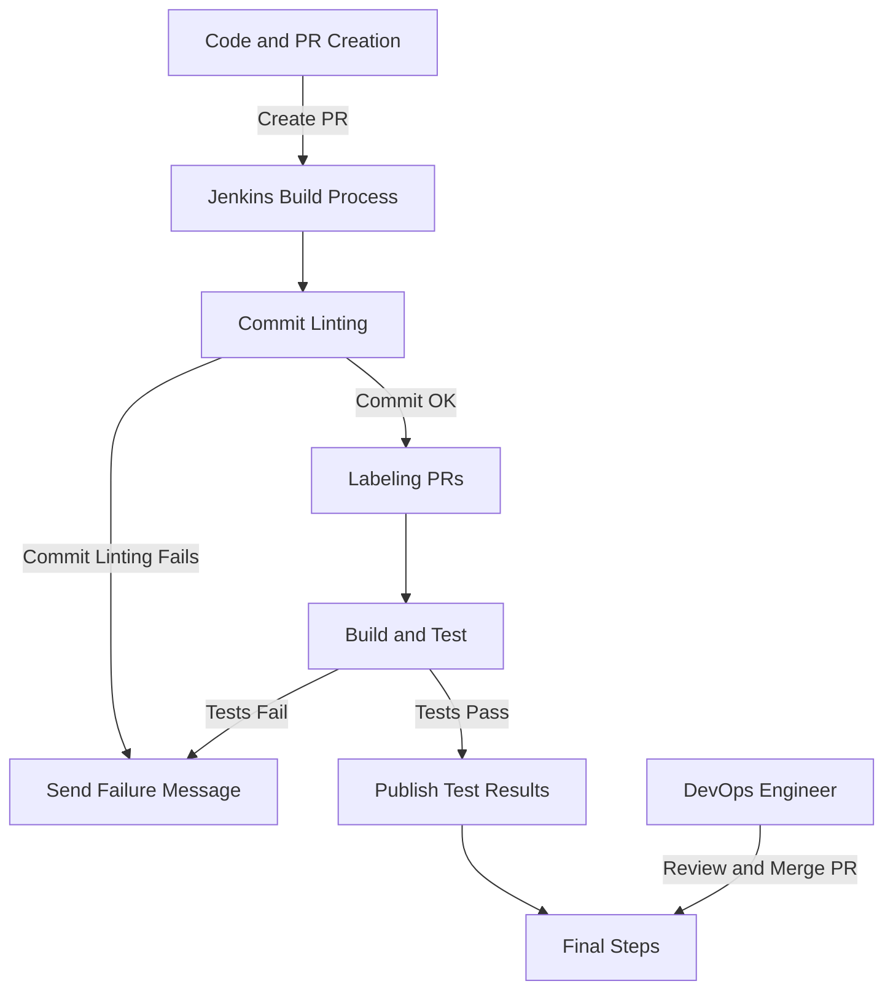
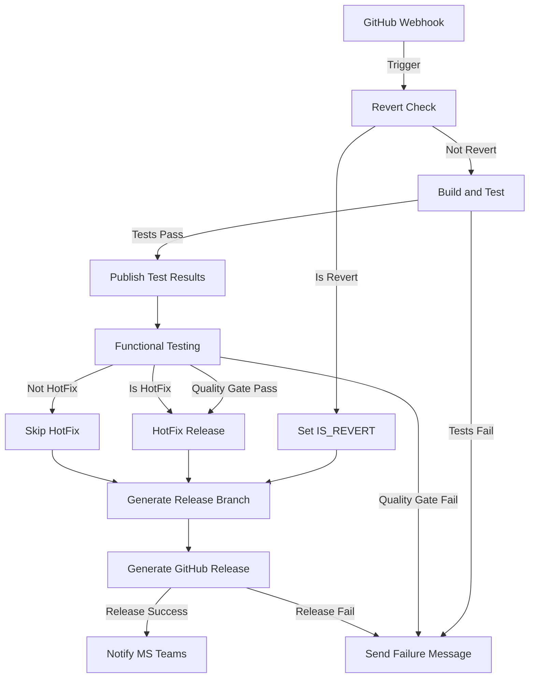
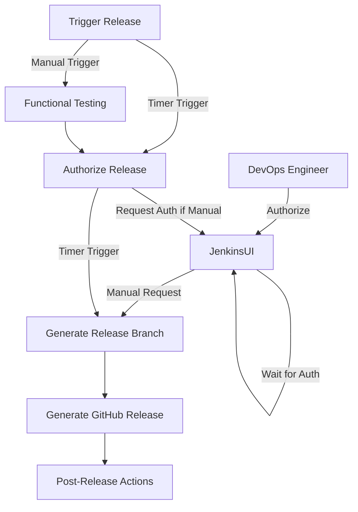

# 5 Runtime View

<!-- TOC -->

- [Runtime View](#runtime-view)
    - [Scenario 1 - PR](#scenario-1---pr)
    - [Scenario 2 - Standard Master Merge](#scenario-2---standard-master-merge)
    - [Scenario 3 - Stable Release Generation](#scenario-3---stable-release-generation)
- [Solution Content](#solution-content)

<!-- /TOC -->

The runtime view describes concrete behavior and interactions of the system’s building blocks in form of scenarios, for the case of this project we will just summarize the main scenarios that are part of the system.

## 5.1 Scenario 1 - PR

| Actor | Description |
|---|---|
| **DevOps Engineer** | Interacts with GitHub to review and merge PRs. |
| **DevOps Collaborator** | Codes, generates unit tests, and regression traces, and creates PRs. |

| Participant | Description |
|---|---|
| **IDE** | Used by the DevOps Collaborator for coding and generating tests. |
| **GitHub** | Central repository for code, handles PRs, and communicates with Jenkins. |
| **Jenkins** | CI/CD tool that handles various stages of the build and deployment process. |

Workflow: 

> [!NOTE] 
> This workflow does not include steps that are not relevant to the runtime view specific of this process

1. **Code and PR Creation**: The Collaborator codes, generates unit tests, and regression traces in the IDE and creates a PR in GitHub. Optionally label the PR as Hot-fix
2. **Jenkins Build Process**: GitHub triggers a webhook to Jenkins, acknowledges the webhook and scans the project.
3. **Commit Linting**: Jenkins verifies the commit and runs `npm install` and `commitlint`.
    - If commit linting is valid, Jenkins sends a "Commit OK" message to GitHub.
    - If commit linting fails, Jenkins checks for errors and sends detailed messages to GitHub, failing the build if necessary.
4. **Labeling PRs**:
    - If there are conventional commits, Jenkins generates a label array and labels the PR in GitHub.
    - If there are revert commits, Jenkins labels the PR as a revert.
    - If neither, Jenkins sends a failure message and fails the build.
5. **Build and Test**:
    - Jenkins builds the project and checks test results (unit and regression).
    - If tests pass, Jenkins publishes the test results.
    - If tests fail, Jenkins publishes the test results, sends detailed messages to GitHub, and fails the build.
6. **Final Steps**:
    - The DevOps Engineer reviews and merges the PR in GitHub.

## 5.2 Scenario 2 - Standard Master Merge

| Actor              | Description                                              |
|--------------------|----------------------------------------------------------|
| **DevOps Engineer**| Interacts with Jenkins UI to authorize releases.         |

| Participant | Description |
|---|---|
| **Jenkins** | CI/CD tool that handles various stages of the build and deployment process. |
| **Jenkins UI** | Interface for Jenkins where the DevOps Engineer authorizes releases. |
| **GitHub** | Central repository for code, handles PRs, and communicates with Jenkins. |
| **Jira** | Project management tool used for pulling XRAY test results. |
| **MS Teams** | Communication tool used for notifications. |

Workflow:

> [!NOTE]
> This workflow does not include steps that are not relevant to the runtime view specific of this process

1. **GitHub Webhook**: GitHub triggers a webhook to Jenkins, acknowledges the webhook and scans the project.
2. **Revert Check**: Jenkins checks if the head is a revert commit and sets the environment variable `IS_REVERT` accordingly to skip checks.
3. **Build and Test**: Jenkins builds the project and checks test results (unit and regression).
   - If tests pass, Jenkins publishes the test results.
   - If tests fail, Jenkins publishes the test results, sends detailed messages to GitHub, and fails the build.
4. **Functional Testing**:
   - Jenkins requests functional tests and waits for execution to finish.
   - Jenkins pulls XRAY test results from Jira and checks the results (Quality Gate 2).
5. **HotFix Release**:
   - Jenkins retrieves the last PR from GitHub and checks PR labels.
   - If the PR is a fix or hotfix, Jenkins retrieves the last release and generates the next tag.
   - Jenkins checks stable and prerelease tags and processes the release accordingly.
   - Jenkins sets the environment variable `IS_HOTFIX` and loads the release config.
   - Jenkins generates the fix CHANGE_LOG, clones the repo, checks out the release, and cherry-picks changes.
   - If the cherry-pick is successful, Jenkins commits and pushes the changes, generates the release, and notifies MS Teams.
   - If the cherry-pick fails, Jenkins notifies MS Teams of the failure.
6. **Release Authorization**: Jenkins requests release authorization from the DevOps Engineer via Jenkins UI.
   - The DevOps Engineer authorizes the release by providing a password and user.
   - If authorization is successful, Jenkins sets the environment variable `AUTH_RELEASE`.
7. **Generate Release Branch**:
    - Jenkins retrieves the last release from GitHub and checks for differences.
    - If differences exist, Jenkins checks the tag, retrieves the last release, and generates the next tag.
    - Jenkins generates the CHANGE_LOG, checks out a new branch, commits, and pushes the changes.
    - Jenkins sets the environment variable `DO_DEPLOY`.
8. **Generate GitHub Release**:
    - If `AUTH_RELEASE` and `DO_DEPLOY` are defined and the status is SUCCESS, Jenkins retrieves tags from GitHub.
    - Jenkins checks stable and prerelease tags and generates release notes.
    - Jenkins generates the release and notifies MS Teams if successful.
    - If the release fails, Jenkins fails the build.

## 5.3 Scenario 3 - Stable Release Generation

| Actor              | Description                                              |
|--------------------|----------------------------------------------------------|
| **DevOps Engineer**| Interacts with Jenkins UI to manually trigger and authorize releases. |

| Participant        | Description                                              |
|--------------------|----------------------------------------------------------|
| **Jenkins**        | CI/CD tool that handles various stages of the build and deployment process. |
| **Jenkins UI**     | Interface for Jenkins where the DevOps Engineer authorizes releases. |
| **Jenkins Timer**  | Triggers the release process on a schedule.              |
| **GitHub**         | Central repository for code, handles PRs, and communicates with Jenkins. |
| **Jira**           | Project management tool used for pulling XRAY test results. |
| **MS Teams**       | Communication tool used for notifications.               |

Workflow:

> [!NOTE] 
> This workflow does not include steps that are not relevant to the runtime view specific of this process

1. **Trigger Release**:
   - **Timer Trigger**: Jenkins Timer triggers the release process on the 1st or 15th of the month.
   - **Manual Trigger**: The DevOps Engineer manually requests a stable release generation.
2. **Functional Testing**:
   - Jenkins pulls XRAY test results from Jira and checks the results (Quality Gate 2).
3. **Authorize Release**:
   - **Manual Request**: Jenkins requests release authorization from the DevOps Engineer via Jenkins UI.
     - The DevOps Engineer authorizes the release by providing a password and user.
     - If authorization is successful, Jenkins sets the environment variable `AUTH_RELEASE`.
     - If authorization times out or fails, Jenkins fails the build.
   - **Timer Trigger**: Jenkins sets the environment variable `AUTH_RELEASE` automatically once checking the timer.
4. **Generate Release Branch**:
   - Jenkins retrieves the last release from GitHub and checks for differences.
   - If differences exist, Jenkins checks the tag, retrieves the last release, and generates the next tag.
   - Jenkins generates the CHANGE_LOG, checks out a new branch, commits, and pushes the changes.
   - Jenkins sets the environment variable `DO_DEPLOY`.
5. **Generate GitHub Release**:
   - If `AUTH_RELEASE` and `DO_DEPLOY` are defined and the status is SUCCESS, Jenkins retrieves tags from GitHub.
   - Jenkins checks stable and prerelease tags and generates release notes.
   - Jenkins retrieves stable and prerelease releases from GitHub.
   - If the prerelease commitish does not exist, Jenkins fails the build.
   - Jenkins clones the JSL repo, checks out the stable branch, and resets from the prerelease commitish.
   - Jenkins force pushes the changes and updates the stable release on GitHub.
   - Jenkins publishes the release to MS Teams.
   - Jenkins updates the prerelease release with the new commitish and tag.
6. **Post-Release Actions**:
   - If the release process fails, Jenkins publishes the failure to MS Teams.

<!-- CONTENTTABLE:START -->
# Solution Content

1. [Introduction and Goals](01-introduction-and-goals.md)
2. [Technical Constraints](02-technical-constraints.md)
3. [System Context and Scope](03-system-context-and-scope.md)
4. [Building Block View](04-building-block-view.md)
5. [Runtime Overview](05-RuntimeOverview.md)
6. [Design Decisions](06-design-decisions.md)
7. [Technical Risks](07-technical-risks.md)
8. [Results](08-Results.md)
<!-- CONTENTTABLE:END -->