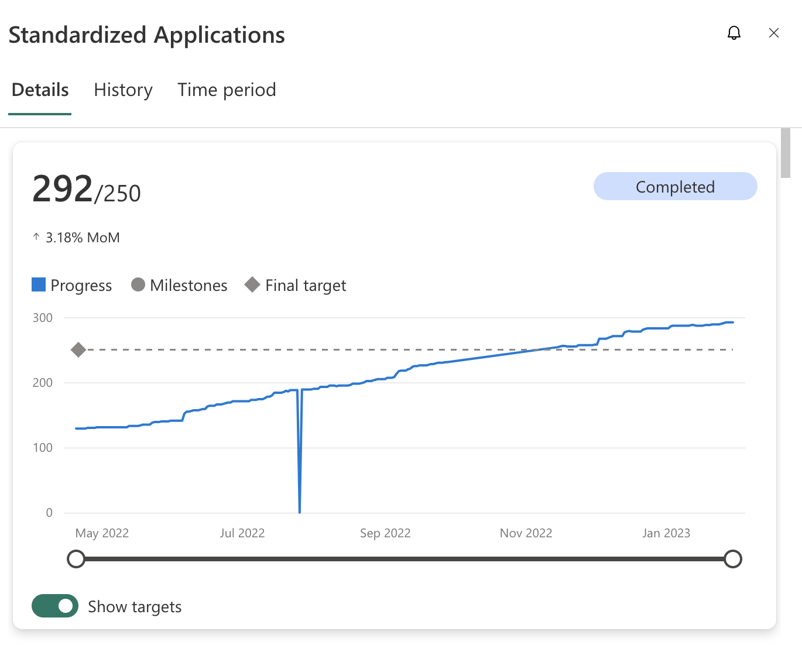

# 8 Results

From the moment of the launch the general adoption by the High Teams was very good, the teams were able to use the JSL without any major issue and the feedback was very positive as per they were able to have more information on the changes being made across the libraries with the release notes:

In terms of the applications adopting the DevSecOps standard, the ammount of onboarded applications increased from 15% to 40% in the first month (July 2022) of adoption of the stable release, which in combination with other actions led to almost 75% of the applications being onboarded by automations or self onboardings by the end of the year.

Addtionally the ammount of applications being standarized pass from 129 to 292 across the year with an increase on adopted in the quarter of adoption of about 40% compared to the previous quarter (21 new apps against 61) and the applications connected to the system increased from 674 to 1031 with an increase of more than 200 from the adoption of the stable release.

The ammount of repositories that have outdated libraries was reduced from 534 to 320 by the end of year.

In terms of Sonar the code was pulished enough to have a High Certification on Dora Metrics.

Additionally there were some results that were not expected as for example the general adoption of conventional commits across teams, specially those using NodeJs, in order to integrate with automatic release notes.

Finally, please remember that the objective was to be able to automate change management, this change helped not only to fulfil those requirements but to help in the delivery of 84% of the roadmap, increasing from 42% to almost 72% in the first month after delivery.

<!-- CONTENTTABLE:START -->
# Solution Content

1. [Introduction and Goals](01-introduction-and-goals.md)
2. [Technical Constraints](02-technical-constraints.md)
3. [System Context and Scope](03-system-context-and-scope.md)
4. [Building Block View](04-building-block-view.md)
5. [Runtime Overview](05-RuntimeOverview.md)
6. [Design Decisions](06-design-decisions.md)
7. [Technical Risks](07-technical-risks.md)
8. [Results](08-Results.md)
<!-- CONTENTTABLE:END -->