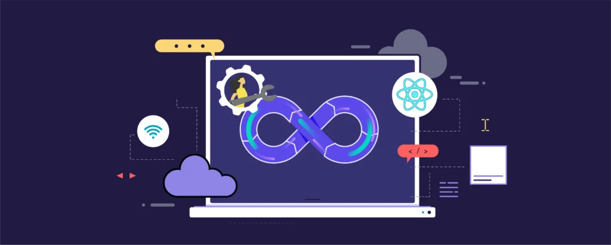

  

<h3 align="center">CI/CD Shared Libraries Release Management Automation</h3>

	<code></code>
	<code></code>
	<code></code>
	<code></code>
	<code></code>
	<code></code>
	<code></code>

# Table of Contents

<!-- TOC -->

- [Table of Contents](#table-of-contents)
- [Executive Summary](#executive-summary)
    - [🎯 Strategic Impact](#-strategic-impact)
    - [Project Context and Challenges](#project-context-and-challenges)
        - [Project Overview](#project-overview)
            - [Background](#background)
            - [DORA Devops KPI](#dora-devops-kpi)
            - [Objectives](#objectives)
            - [Solution Strategy](#solution-strategy)
- [Solution Content](#solution-content)

<!-- /TOC -->

# Executive Summary

The **Jenkins CI/CD Shared Libraries Release Management** initiative was a strategic effort to enhance the **reliability, automation, and scalability** of CI/CD pipelines across a **large-scale DevSecOps environment**. 

The system in nature was increasingly complex with over **1,000 applications and 3,000 repositories** which where needed to be digitally transformed in order to adop industr-level standards.

As part of the Enterprise opbjective of **reducing the time to market**, it was required to integrate with the change management tools and being able to generate automated Changes. However, change management intoduced as a requirement that the libraries used need to be at least **[DORA](#dora-devops-kpi) HIGH** and be available as soon as possible tpo the applications in order to validate the change management automation.

To achieve this the team needed to **eliminate deployment inconsistencies, reduce technical debt, and streamline release processes** while ensuring compliance with DevSecOps standards.

The challeneges addressed by this initiative were:
- :no_entry_sign: **Unstable CI/CD Pipelines**
- :no_entry_sign: **Lack of Change Control**
- :no_entry_sign: **Inconsistent Release Management**
- :no_entry_sign: **Low Visibility & Observability**
- :no_entry_sign: **Technical Debt & Security Risks**

To address these challenges, I designed and implemented **a multi-layered optimization strategy** centered around **automated release management** and **high level code testing**:
- :one: Automated Release & Versioning System
    - Introduced **Conventional Commits** to enforce structured releases.
    - Implemented **automated changelog generation** to improve transparency and traceability.
    - Established **a governance model** ensuring backwards compatibility across library versions, called **STABLE RELEASE**

- :two: CI/CD Reliability Optimization
    - Integrated **preemptive validation testing** (Regression) to catch issues before publishing.
    - Introduced functional testing framework for Jenkins Shared Libraries to ensure **correctness and stability**.

- :three: Security & DevSecOps Alignment
    - Reduced **SonarQube Code Quality Issues** to meet **[DORA](#dora-devops-kpi) HIGH**  standards
    - Increase **Unit Test Coverage to 80%** and **Functional Testing to 30%**.

##  1. :dart: Strategic Impact

This initiative not only **modernized SL** but also **set a new foundation for scalable, high-reliability CI/CD practices**. By combining **automation, observability, and governance**, the project significantly improved **developer experience, operational efficiency, and release stability**.

It also provided **transformative effect** for the organization by enabling **development teams** and other important teams, such as **Change Management**, to rely on the **Jenkins Shared Libraries**—the backbone of the **CI/CD system**—accelerating the adoption of **DevSecOps standards** across the enterprise, ultimately expediting the **time-to-market** for mature applications through an **automated change management process**.

The project provided significant improvements in key metrics:

- :star2: Nearly doubled the number of onboarded repositories within six months post-adoption (**674 -> 1031**).
- :star2: Reduced the number of repositories with outdated libraries from **534 to 320**.
- :star2: Increased the number of applications achieving a **[DORA](#dora-devops-kpi) HIGH**  Performance KPI from **10 to 75**. And added 1 application framework to the **Elite category**
- :star2: Boosted test coverage to 80% and functional testing to 30%.
- :star2: Enhanced code quality in SonarQube, achieving **[DORA](#dora-devops-kpi) HIGH**  standards.

For more detailed insights, refer to the [Results](./08-Results.md) section.

##  2. Project Context and Challenges

This document aim to describe a project that caused high impact over my career on one or more of the following areas:

- Infrastructure maintenance & monitoring. Cloud and on-premise.
- CI/CD & automation testing
- Runbooks and disaster recovery processes
- New UAT/DEV environment setup
- Incident tracking and analysis
- SLO monitors, alerts, and notifications
- Performance monitoring, load tests, auto-scaling
- Cloud cost optimizations
- Security

###  2.1. Project Overview

This initiative was designed to **enhance trust, reliability, and adoption** of the shared libraries that serve as the **core foundation of the enterprise CI/CD system**. This project played a **crucial role in accelerating DevSecOps adoption** by ensuring development teams had **a stable and reliable** set of shared libraries, ultimately **reducing deployment risks and increasing time-to-market efficiency** for mature applications.  

The initiative was originated from an effort to automate the change management process in order to reduce the time to market of mature Applications, but as the project progressed, it diverged into two separated but interconnected streams:  

1. **CI/CD Shared Libraries Release Management Automation** (the primary focus of this document).  
2. **Automatic Change Management Process**, which later aimed to integrate with the enhanced Jenkins Shared Libraries.  

Although the ultimate objective was to seamlessly integrate CICD with the Automated Change Management process, this document primarily focuses on thefirst initiative 

> [!WARNING] 
> **Code Disclaimer** :The code presented in this project is a **simplified version** of the original implementation and is **not intended for production use**. Additionally, **all proprietary and confidential information has been removed** to comply with security and data protection policies.  

> [!WARNING] 
> **AI Ussage** : Some of the content of this documentation has been redacted or reviewed by AI to ensure that no sensitive information is shared or to simplify the content as well as summarixing pseudocode that might be copnfusing after the sensitive code removal. Tools used included OpenAI and GH Copitlot.

####  2.1.1. Background

In **2022**, a leading telecommunications company embarked on a massive DevSecOps transformation project, aiming to onboard **over 3,000 repositories across 1,000 applications** to adopt **DevSecOps standards**. The **Jenkins Shared Libraries team**, a group of just **five engineers**, was responsible for maintaining the **core CI/CD automation layer**.  

However, the initial project didn´t consider the increasing demmand of the development teams and ledership stakeholders and  it became clear that the **existing shared libraries management process was unsustainable**, leading to **bottlenecks, reliability issues, and slower time-to-market**

The team identified **several critical issues** that contributed to pipeline instability and slowed DevSecOps adoption:  

 - :one: Unstable Release & Versioning Management**  
    - Cherry-picking updates 
    - No centralized versioning process
    - Lack of structured Release Not, making debugging and tracking difficult for new adopters

- :two: Technical Debt & Outdated Libraries**  
    - **534 out of 674 pipelines (79%) were using outdated libraries.**  
    - **No structured process to enforce updates**,
    - **Regression issues** due to unmanaged **technical debt accumulation**.  

- :three: Insufficient Testing & Quality Control**  
    - Only 30% unit test coverag  
    -No functional testing framework** implemented.
    - **No regression testing**, making changes **risky and unpredictable**.  
    - **SonarQube reported low-quality code**, further increasing the risk of instability.  

- :four: Inefficient Change Management Process (GCR)
    - Development teams prepared a release and ensured all stories were completed.  
    - Teams manually submitted a Change Request (GCR), requiring extensive documentation.  
    - The Change Management Team reviewed the request, which could takeseveral hours.  
        - ✅ If approved, the release was scheduled.  
        - ❌ If rejected, the process restarted, delaying deployments.  
    - The development team executed the release on the scheduled date.  
    - Teams manually reported release results back into ServiceNow.  

The company recognized that automating the Change Management proces was essential to enabling DORA High/Elite-Performance development teams. However, for automation to succeed it was required that the Jenkins Shared Libraries and related core components where stable, reliable and tested enough to ensure that the applications that are using them will not be affected by the changes that are made to the libraries and also to be able to receive the latest updates as soon as possible.

At the time, Jenkins Shared Libraries **lacked the stability required to support automatic change approvals**. Specifically:

- **No automated testing**, making releases unpredictabl.  
- **Frequent critical failures**, requiring cherry-picked updates.  
- **Security patches** were not consistently adopted across teams.  

By addressing these challenges, this project played a key role in accelerating DevSecOps adoption, improving CI/CD reliability, and enabling faster, more secure software delivery.  

####  2.1.2. DORA Devops KPI

The [DORA](https://dora.dev/guides/dora-metrics-four-keys/) metrics are a set of metrics that are used to measure the performance of the development teams and the applications. Internally this was adapted as below

| KPI | Low | Medium | High | Elite |
|-----|-----|--------|------|-------|
| **Deployment Frequency** | Less than a month | 1/month - 1/week | 1/week - 1/day | On demand |
| **Avg deployment speed** | 2h | 30-120 minutes | 15-30 minutes | < 15 minutes |
| **Average time for changes** | more than a month | 1 week - 1 month | 1 day - 1 week | < 1 day |
| **MTTR (Mean Time to Restore)** | more than a week | 1 day - 1 week | 1 day - 1 hour | < 1 hour |
| **Change Failure Rate** | > 45%| 31-45% | 16-30% | 0-15% |
| **Code Quality Bug Score** | At last 1 blocker or critical Bug (E & D Score) | At least 1 major Bug (C Score) | At least 1 minor Bug (B Score) | No Bugs (A Score) |
| **Static Application Security Testing (SAST)** | At last 1 blocker or critical Vulnerability (E & D Score) | At least 1 major Vulnerability (C Score) | At least 1 minor Vulnerability (B Score) | Info Only (A Score) |
| **Dependency Vulnerabilities** | At last 1 Critical or HighSeverity Level |  At least 1 Medium Severity Level | At least 1 Low Severity Level | No Vulnerabilities |
| **Test Automation** | Less than 20% |20-80% | >80% | >80% |
| **Functional Testing** | No | All Test Run | All Test Pass | All tests Pass |

This in important to understand what is a mature application and what was the objective of the JSL improvements.

####  2.1.3. Objectives

The main objectives of this project were:

| **Objective ID** | Objective | Details |
|--------------|-----------|---------|
| **OBJ-001** | Increase Maturity (**[DORA](#dora-devops-kpi) HIGH** ) of the Jenkins Shared Libraries and related core components | - Increase Unit Test Coverage to 80% - Implement Functional Testing with at least 30% of coverage - Implement Regression Testing for Unit and Functional Testing - Fix SonarQube Issues or justify the existence of them |
| **OBJ-002** | Create a way to automatically generate Release Notes and Change Logs | - Releases should be automatically updated each 15 days to ensure features are under testing on latest code and be incorporated to Stable when ready for production - Hot Fixes should be automatically included on stable release if possible - Fixes should be included on current release if possible |
| **OBJ-003** | Create a way to automatically update the applications that are using the Jenkins Shared Libraries and related core components | |

####  2.1.4. Solution Strategy

  

This section outlines the **high-level strategy** used to resolve the challenges of the project . The core **design principles** ensured that:  
- ✅ The **existing Groovy (JDK 11) & Jenkins** execution environment remained unchanged.  
- ✅ **Testing automation** improved reliability while maintaining **scalability & maintainability**.  
- ✅ **Release generation & management** need to follow an **automated, predictable process**.  
- ✅ **Security & governance** were reinforced via **controlled GitHub workflows & access policies**.  

- :one: Functional Testing & Validation  
Since Jenkins lacks **efficient functional testing frameworks**, we developed a **custom pipeline-based approach**:  
    - **Test Execution**: A dedicated pipeline dynamically loads JSL components in a controlled execution context.  
    - **Reporting & Tracking**: All test results are **published to Jira via Xray**.  
    - **Configuration**: Tests are defined in **YAML**, ensuring both **human readability** and machine compatibility.  
    - **Docker-Based Execution**: A bundled Dockerfile was created to support all required dependencies & capabilities.  
    - **Regression Testing**: Implemented using **[JenkinsPipelineUnit](https://github.com/jenkinsci/JenkinsPipelineUnit)** for consistency.  

- :two: Release Automation: All release generation and lifecycle management were built around the [GitHub API](https://docs.github.com/en/rest/releases?apiVersion=2022-11-28) 

- :three: Automated Release Process**  
    - **Bi-Weekly Release Cycle**: A new stable release is generated every 15 days.  
    - **Pre-Release Strategy**: The **prerelease tag** acts as the stable reference for the next production release.  

- :four: Stable Release Governance
    - **Force-Push Policy**: The prerelease tag is force-pushed **only by GitHub Apps**, ensuring **same tag** can be used across systems and users/admins **can´t overwrite** the contents.  
    - **Manual Review for PRs**: Engineers are still required to create pull requests (PRs) for any change or manual merge.

- :five: Hotfix & Patch Management: to reduce the mean time to restore and the change failure rate, the following strategy was implemented
    - **Fixes are automatically backported** to both the **current release & prerelease**.  
    - **Conflict Handling**: If a conflict occurs, the engineer must **manually resolve and create a PR**.  
    - **Hotfix PRs Target the Stable Branch**
    - **Automated Release Notes**

- :six: Automated Release Notes
    - **GitHub Release Notes System** is used to document changes. based on **[Conventional Commits](https://www.conventionalcommits.org/en/v1.0.0/)** which are enforced to **auto-classify changes (fix, feat, chore, etc.)**.  

<!-- CONTENTTABLE:START -->
# Solution Content

1. [Introduction and Goals](01-introduction-and-goals.md)
2. [Technical Constraints](02-technical-constraints.md)
3. [System Context and Scope](03-system-context-and-scope.md)
4. [Building Block View](04-building-block-view.md)
5. [Runtime Overview](05-RuntimeOverview.md)
6. [Design Decisions](06-design-decisions.md)
7. [Technical Risks](07-technical-risks.md)
8. [Results](08-Results.md)
<!-- CONTENTTABLE:END -->